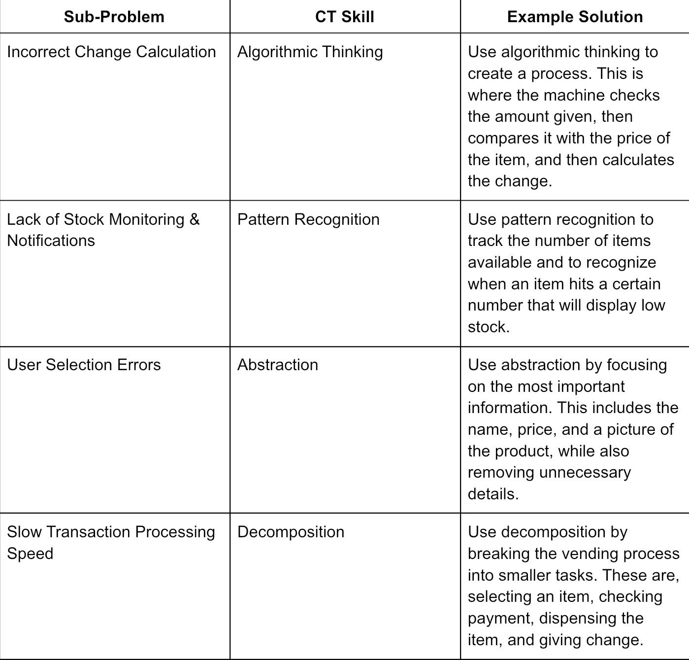

Computational Thinking Exercise: "Smart Vending Machine"
Section: 9-Pinatubo    Score: -

C / Name: #07 / Espiritu, Eliezer Marc #08 / Intal, Kurt Ashe #09 / Legaspi, Daniel     Date: August 16, 2026

Scenario:
Your school installs a vending machine to provide snacks and drinks. However, students encounter several issues:

- Sometimes the machine does not give the correct change.
- Items run out, but the machine doesn’t notify anyone.
- Students press the wrong buttons and get the wrong item.
- The machine is slow when multiple students use it in succession.

Your task is to decompose this problem into smaller, manageable parts that could be solved with computational thinking (CT) Skills.

Step 1: Identify the Big Problem
Main Problem: The machine is not able to correctly or efficiently process transaction, leading to errors regarding change, inventory, item selection, and speed.

Step 2: Identify three to four Sub-Problems
Please list possible sub-problems:

1. Incorrect Change Calculation
2. Lack of Stock Monitoring & Notifications
3. User Selection Errors
4. Slow Transaction Processing Speed

Step 3: Define Computational Thinking Approaches

Step 4: Draw a flowchart or write a pseudocode for the identified sub-problem
   
