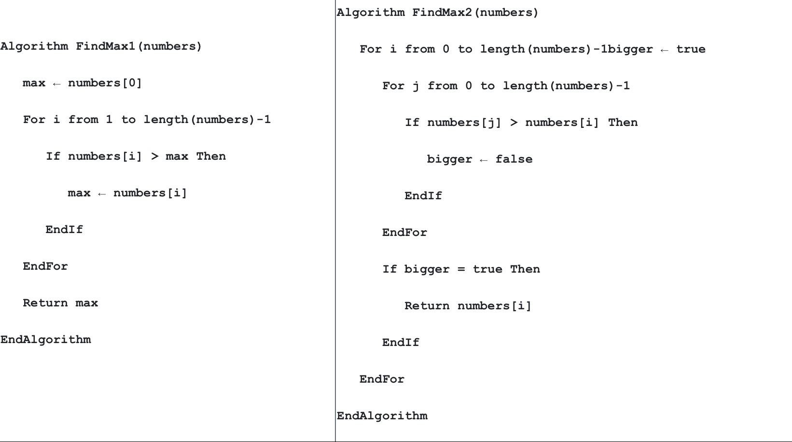
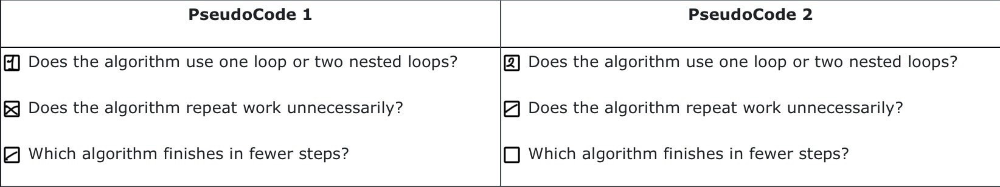
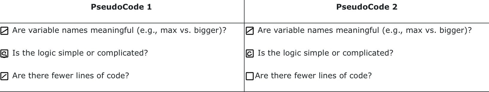
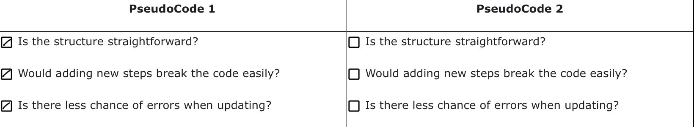
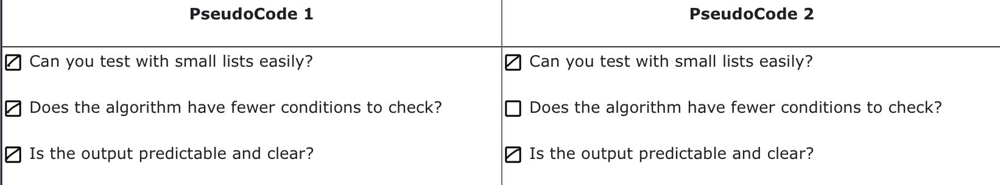
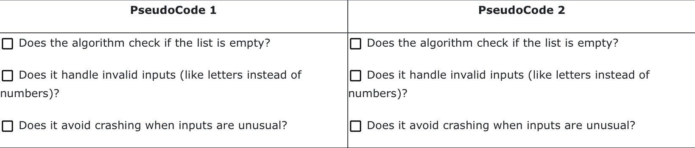

Code Quality Assessment 

C# / Name: #07 Espiritu, Eliezer Marc #08 Intal, Kurt Ashe #09 Legaspi, Daniel Date: August 16, 2026

Problem: 

Finding the highest (maximum) number from a given list of numbers.
PseudoCode 1 & PseudoCode2  
  

1. Efficiency  
Which algorithm is faster when the list of numbers is very large? Why?  
PseudoCode 1 is faster when it comes to a larger number. This is because rather than using nested loops to repeatedly check each number if its larger than all the other numbers, pseudocode 1 uses a single loop to check on each number and updating if it is a value that is bigger than the previous.  
Checklist:  
  
2. Readability   
Which algorithm is easier to understand at first glance? What makes it clearer?  
PseudoCode 1 is easier to understand. Pseudocode 1 uses a single for loop and a direct method by updating a single variable. In contrast, pseudocode 2 uses unnecessary code that makes its process alot longer and difficult to understand.  
Checklist:  
  
3. Maintainability  
If you had to add a new feature, like finding both max and min, which algorithm would be easier to update? Why?  
PseudoCode 1 is the easier algorithm to update. In pseudocode 1, you would only need to add a min variable and track it in a single check in each number of the value given. PsuedoCode 2 on the other hand, would need extra nested loops which would make the code more complex than it already is.  
Checklist:  

4. Testability  
Which algorithm is easier to test with different inputs? Why?  
PseudoCode 1 is easier to test. Related to our previous answers, pseudocode 1 has a more simple to understand code which also makes it easy to debug whenever a problem occurs. PseudoCode 2 has a complex code that makes it difficult to fix problems.  
Checklist:  
  
5. Security  
What should the algorithm check if the input list comes from a user?  
The algorithms should check if the input of the user is a real whole number integer. Other inputs from the user should be denied and be asked the same question again.  
Checklist:  
  
6. Final Answer  
Which algorithm is better? Why?
PseudoCode 1. Using our answers in the previous questions, we find pseudocode 1 significantly easier to use than pseudocode 2. Our answer is because the code is much more faster, simpler, easy to debug, and test different inputs.  

